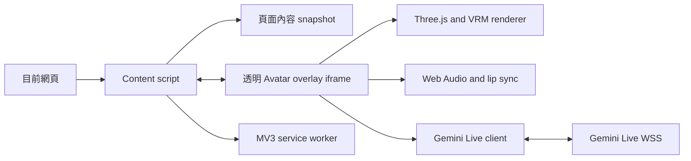

# PageAskVrm Chrome Extension 實作規劃

> 狀態：規劃稿
>
> 目標：以 `D:\SideProject\pages\vrm\sha.vrm` 為 Avatar，在目前網頁右下角顯示透明背景的 3D Avatar，透過 Gemini Live API 進行可插話的語音對談，並讓 Gemini 依回覆內容控制 Avatar 情緒與動作。

## 1. 可行性結論

可行，且現有兩個參考專案已涵蓋大部分核心技術。建議先做一個「Extension overlay + `sha.vrm` + 麥克風 + 一輪 Live 對談」的垂直切片，再擴充頁面內容同步與 BYOK 設定體驗。

| 能力 | 判斷 | 依據與主要限制 |
|---|---|---|
| 右下角透明 Avatar | 可行 | 用 content script 注入固定位置的透明 extension iframe；iframe 內使用 WebGL alpha canvas，不影響網頁排版。 |
| `sha.vrm` 載入 | 可行 | `Avatar/app.js` 已使用 `GLTFLoader`、`VRMLoaderPlugin` 與 `VRMUtils` 載入同一路徑模型；模型目前約 7.7 MB。 |
| Gemini Live 雙向語音 | 可行 | Live API 支援 WSS 雙向串流；輸入為 raw PCM，輸出為 24 kHz PCM。 |
| 參考當前網頁內容 | 可行 | content script 讀取目前頁面 DOM，整理成有邊界的「不可信頁面內容」後，在建立 Live session 時提供給模型。這不是 Live API 自動讀頁面，必須由 Extension 主動擷取。 |
| Avatar 情緒 | 可行 | 沿用 `set_avatar_emotion` function declaration 與 VRM expression alias 對應。 |
| Avatar 動作 | 可行 | 沿用 `play_avatar_gesture` 與 `AvatarGesturePlayer`；`gemini-3.1-flash-live-preview` 的 function calling 應按同步工具設計。 |
| Chrome Web Store 正式發布 | 可行，但需調整 | `Avatar` 的 CDN import map 不能原樣使用；MV3 需把可執行程式碼打包在 Extension 內。BYOK API key 由使用者自行提供與管理。 |

Live API 的 client-to-server 方案適合低延遲串流；本專案採 BYOK，由使用者在設定頁提供自己的 Gemini API key。[Gemini Live API overview](https://ai.google.dev/gemini-api/docs/live-api)

## 2. 參考專案可重用內容

### `D:\SideProject\PageAsk`

- MV3 manifest、service worker、`activeTab`、`scripting` 與權限處理方式。
- `content-picker.js` 的 content script 注入與 DOM 文字擷取模式。
- `js/source.js` 的來源文字正規化、URL 清理與長度限制。
- `js/gemini.js` 的 Live session 狀態、WebSocket 訊息處理、PCM 音訊、字幕、插話、session resumption、GoAway 與 context window compression。
- `js/audio.js`、`js/audio-capture-worklet.js` 的麥克風 PCM 擷取、重取樣、24 kHz 播放與中斷清除。
- `js/constants.js` 的 Live model、voice、thinking level 與設定資料結構。
- 現有測試可改寫為 Extension overlay 的 unit test 與 protocol test。

目前 `PageAsk` 的來源主要是反白區塊或檔案；`PageAskVrm` 改成「目前頁面 snapshot」，並由使用者以 BYOK API key 建立 Live 連線。

### `D:\SideProject\pages\Avatar`

- `VRMAvatarController`：透明 WebGL renderer、模型縮放、相機、骨骼、表情、呼吸、眨眼、姿態與資源釋放。
- `avatar-emotions.js`：情緒 enum、參數驗證與 function response。
- `avatar-gestures.js`：10 種動作、骨骼偏移、淡入淡出、等待語音開始才播放、插話時取消。
- `LipSyncEngine`：以 Gemini 回傳的 PCM 音訊分析 viseme，映射 VRM mouth expression。
- `AvatarStateMachine`：idle、listening、thinking、speaking、interrupted。
- `GeminiLiveClient`：目前已能處理 `responseModalities: ["AUDIO"]`、雙方 transcription、工具呼叫與 session resumption。

`Avatar` 的邏輯應拆成可測試模組後移植，不應直接把整支 `app.js` 塞進 content script；目前 `app.js` 同時包含頁面 UI、設定頁、Live client、音訊與 Avatar renderer。

## 3. 建議架構



### 3.1 Content script

責任限定為目前網頁的橋接層：

1. 接受 service worker 的啟用指令。
2. 注入一個 `position: fixed`、`bottom/right` 定位的 iframe。
3. 讀取頁面標題、URL 與可見文字，產生 page snapshot。
4. 監聽 SPA URL 變更、標題變更與必要的內容變更。
5. 將 page snapshot 傳給 overlay；不接觸 Gemini API key、逐字稿或音訊內容。

預設採「使用者點擊 Extension action 後才在目前分頁啟用」，以便使用 `activeTab` 減少永久的所有網站存取權。若日後要安裝後自動顯示，再以 optional host permission 提供選項。

### 3.2 Overlay iframe

iframe 是 Extension 自己的頁面，負責所有高權限或高效能工作：

- Three.js、`@pixiv/three-vrm`、WebGL canvas。
- Gemini Live client 與 WebSocket。
- 麥克風、PCM worklet、音訊播放與 lip sync。
- 以 `chrome.storage` 讀取設定。
- 以 `chrome.storage` 讀取使用者提供的 BYOK API key。
- 只顯示 Avatar；輸出文字由使用者決定是否顯示。啟用時在 Avatar 上方顯示漫畫風格對白框；狀態、錯誤與設定可採透明小 badge 或滑鼠移入後顯示的最小控制，不建立 PageAsk side panel 作為主要互動介面。

iframe 建立時加上 `allow="microphone"`，並且只在使用者點擊 Avatar 或明確的開始控制後呼叫 `getUserMedia`，避免被瀏覽器的自動播放與麥克風政策阻擋。

### 3.3 Service worker

只負責 Extension lifecycle 與權限邊界：

- action click 後對目前 tab 執行 `content-bridge.js`。
- 驗證 content script message 的格式與 sender。
- 管理 tab 對應的 overlay 啟用狀態。
- 不代理 Gemini 請求，也不保存頁面全文。
- 不在 service worker 中建立 WebGL、AudioContext 或長時間 Live socket，避免 MV3 worker 被回收。

Chrome content script 可以讀取宿主頁面的 DOM，但與宿主頁面的 JavaScript world 隔離；Extension 內容與頁面之間應採明確的訊息驗證。[Content scripts](https://developer.chrome.com/docs/extensions/develop/concepts/content-scripts)、[Message passing](https://developer.chrome.com/docs/extensions/develop/concepts/messaging)

## 4. 頁面內容策略

### 4.1 Snapshot 規則

初版不嘗試把整個 DOM 或所有 iframe 傳給 Gemini，而是建立單一可控的文字 snapshot：

- 優先讀取 `main`、`article`、`[role="main"]`、`h1` 到 `h6` 與段落內容。
- 排除 `script`、`style`、`noscript`、`nav`、`footer`、表單、廣告常見容器與 Extension 自己的 root。
- fallback 使用 `document.body.innerText`。
- 沿用 `PageAsk` 的 whitespace normalization 與安全 URL 處理。
- 建議 `PageAskVrm` 初版上限為 24,000 字元，超出時附上「內容已截斷」標記；中文頁面不宜直接沿用 60,000 字元，否則可能佔滿 Live session context。
- 以明確的 `<page-reference>` 邊界包住內容，並在 system instruction 中宣告：頁面內容是不可信資料，不可覆寫系統規則、索取秘密或觸發工具。

### 4.2 何時更新

- Overlay 啟用時讀取一次 snapshot。
- URL 或頁面標題變更時，標記為新頁面；若 Live 對談正在進行，先停止音訊與舊 session，再以新 snapshot 建立新 session。
- 一般 DOM mutation 不立即重建 session，只更新「頁面內容已變更」旗標，避免新聞頁、社群頁或動態頁面造成連續重連。
- 第二版再考慮明確的「重新讀取目前頁面」手勢。

這個策略能保持 Live session 的上下文清楚，也避免把每次 DOM mutation 誤送成使用者發言。

## 5. Gemini Live 設計

### 5.1 MVP session 設定

建議使用官方目前的 JavaScript SDK `@google/genai` 並由 overlay 建立 Live session：

- model：`gemini-3.1-flash-live-preview`
- response modality：`AUDIO`
- voice：沿用 `Avatar` 的 `Aoede` 預設值，之後可加入 PageAsk 的 voice 設定
- `inputAudioTranscription`：開啟，供內部狀態與除錯使用
- `outputAudioTranscription`：開啟；當使用者選擇顯示文字時，將串流 transcription 放入漫畫風格對白框
- `contextWindowCompression`：開啟
- `sessionResumption`：保存最新 handle，遇到 GoAway 或 socket 中斷時重連
- function declarations：`set_avatar_emotion`、`play_avatar_gesture`

Live API 的輸入音訊是 raw little-endian 16-bit PCM，慣用 16 kHz；輸出音訊為 24 kHz PCM。長時間 session 需要 context compression 與 session resumption。[Live API capabilities](https://ai.google.dev/gemini-api/docs/live-api/capabilities)、[Session management](https://ai.google.dev/gemini-api/docs/live-api/session-management)、[Live API best practices](https://ai.google.dev/gemini-api/docs/live-api/best-practices)

### 5.2 工具規則

沿用目前 `Avatar` 的限制：

- 每個回覆最多一個 emotion。
- 每個回覆最多一個 gesture。
- Gemini 只傳 enum 值，不直接控制骨骼、嘴型或連續動畫。
- emotion 立即套用並以約 0.3 秒淡入。
- gesture 先排隊，等第一段語音開始再播放；被插話、斷線或結束時淡出。
- function call 參數錯誤時回傳 tool error，不讓錯誤資料進入骨骼控制器。

`gemini-3.1-flash-live-preview` 的 Live API function calling 目前應以同步工具處理；因此 Avatar emotion／gesture handler 必須在收到 call 後立即回覆，不設計成非同步背景工作。[Tool use with Live API](https://ai.google.dev/gemini-api/docs/live-api/tools)

### 5.3 API key（BYOK）

- 設定頁由使用者輸入自己的 Gemini API key。
- API key 只保存在 `chrome.storage.local`，不經 content script 或 service worker 轉送。
- Overlay 直接使用 BYOK API key 建立 Gemini Live session。
- README 與設定頁明確說明：金鑰以未加密形式保存在 Chrome 使用者設定檔，使用量與費用由使用者的 Google AI 帳戶承擔。

## 6. Avatar 與透明 UI 實作

### 6.1 Extension asset

`sha.vrm` 應複製為 Extension 自己的資產，例如：

```text
PageAskVrm/
├─ public/
│  └─ avatars/
│     └─ sha.vrm
```

Runtime 使用 `chrome.runtime.getURL("avatars/sha.vrm")` 或 Vite 的 asset URL，不依賴 `D:\SideProject\pages\vrm` 的相對路徑。這是必要的，因為封裝後 Extension 不會保證能讀取工作區外的檔案。

### 6.2 Renderer

從 `Avatar/app.js` 抽出下列模組：

- `VrmAvatarController`
- `AvatarStateMachine`
- `AvatarGesturePlayer`
- `AvatarEmotionController`
- `LipSyncEngine`
- `GeminiAudioPlayer`

renderer 設定：

- `WebGLRenderer({ alpha: true, antialias: true })`
- `setClearColor(0x000000, 0)`
- overlay root 與 iframe 背景皆為 transparent
- `iframe` 固定在右下角，初版建議約 260 x 360 px
- root 預設 `pointer-events: none`，只有 Avatar 可互動區開啟 pointer events
- 設定 device pixel ratio 上限，避免在高 DPI 螢幕與網頁 GPU 同時使用時過重
- 保留 `VRMUtils.deepDispose`，在 tab 關閉、頁面變更、模型重載時釋放 GPU 資源

### 6.3 `sha.vrm` 相容性

載入後先列出實際存在的 humanoid bones 與 expression names：

- 缺少 expression 時退回 neutral 或無嘴型，不讓整個 Avatar 失效。
- 缺少手指或手臂 bone 時只略過該 bone 的 gesture offset。
- 保留目前的 expression alias 對應，並在 Phase 0 產出 `sha.vrm` 的 capability report。

### 6.4 漫畫風格對白框

文字顯示是獨立於 Avatar canvas 的 overlay DOM 元件，不把文字繪進 VRM 或 WebGL：

- 設定頁提供「顯示 Gemini 回覆文字」開關，設定保存於 `chrome.storage.local`。
- 預設依產品設定決定；關閉時仍可保留 transcription 在記憶體供除錯，但不渲染到畫面。
- 開啟時使用 `outputAudioTranscription` 的串流片段，透過 `textContent` 更新，避免把模型輸出當成 HTML。
- 對白框位於 Avatar 上方，使用圓角、粗外框、尾巴與輕微彈跳效果，視覺上接近漫畫對話框；不使用不透明全屏背景。
- 以目前語音回覆為單位合併 partial transcript，限制最大字數與行數；超出時截斷並顯示省略號。
- 一輪回覆結束後保留短時間再淡出；新回覆開始時立即替換；模型被插話時立即清除或停止更新。
- 對白框需依 viewport 與 Avatar 尺寸自動調整，避免超出視窗；手機／窄視窗時改為 Avatar 上方的較窄氣泡。
- 若 transcription 尚未到達或發生錯誤，不影響音訊、嘴型、情緒與動作。

## 7. 建議目錄與技術棧

```text
PageAskVrm/
├─ manifest.json
├─ package.json
├─ vite.config.ts
├─ public/
│  └─ avatars/sha.vrm
├─ src/
│  ├─ background/service-worker.ts
│  ├─ content/content-bridge.ts
│  ├─ content/page-context.ts
│  ├─ overlay/overlay.html
│  ├─ overlay/overlay.ts
│  ├─ overlay/overlay.css
│  ├─ avatar/vrm-avatar-controller.ts
│  ├─ avatar/emotions.ts
│  ├─ avatar/gestures.ts
│  ├─ audio/audio-engine.ts
│  ├─ audio/pcm-capture.worklet.ts
│  ├─ live/gemini-live-client.ts
│  └─ shared/messages.ts
├─ tests/
│  ├─ page-context.test.ts
│  ├─ live-protocol.test.ts
│  ├─ avatar-tools.test.ts
│  └─ overlay-smoke.test.ts
```

| 類別 | 技術 | 用途 |
|---|---|---|
| Extension | Chrome Manifest V3 | action、content script、service worker、storage |
| Build | Vite + TypeScript | 將 Extension 程式碼與 Three.js 依賴打包成 local assets |
| 3D | Three.js + `@pixiv/three-vrm` | WebGL 與 VRM 1.0/相容模型載入 |
| AI | `@google/genai` Live API | Live session、音訊串流、transcription、function calling |
| Audio | Web Audio API + AudioWorklet | 麥克風 PCM、輸出排程、音量分析、lip sync |
| Storage | `chrome.storage.local` / `chrome.storage.session` | 設定與目前 tab session 狀態 |
| Backend | 不需要 | Extension 直接使用使用者提供的 Gemini API key（BYOK） |
| QA | Node test runner + Playwright | unit、訊息協定、實際 Chromium overlay 流程 |

MV3 extension page 預設只允許載入 Extension 自己的程式碼，且 Chrome Web Store 不接受任意遠端 hosted code；因此 Three.js、three-vrm、Gemini SDK 都要在 build 時打包，不使用 `unpkg`、`jsdelivr` 或 HTML import map 載入可執行 script。[Extension CSP](https://developer.chrome.com/docs/extensions/reference/manifest/content-security-policy)、[Remote hosted code](https://developer.chrome.com/docs/extensions/develop/migrate/remote-hosted-code)

## 8. Manifest 與權限規劃

初版建議：

```json
{
  "manifest_version": 3,
  "permissions": ["storage", "activeTab", "scripting"],
  "host_permissions": [
    "https://generativelanguage.googleapis.com/*"
  ],
  "optional_host_permissions": ["http://*/*", "https://*/*"],
  "background": {
    "service_worker": "assets/service-worker.js",
    "type": "module"
  },
  "web_accessible_resources": [
    {
      "resources": ["overlay.html", "avatars/sha.vrm"],
      "matches": ["http://*/*", "https://*/*"]
    }
  ],
  "content_security_policy": {
    "extension_pages": "script-src 'self'; object-src 'self'; connect-src https://generativelanguage.googleapis.com wss://generativelanguage.googleapis.com"
  }
}
```

確認 build 後 overlay 的檔名與 `web_accessible_resources` 一致。若不提供自動注入，就不需要一開始要求 `<all_urls>`；`activeTab` 可在使用者明確點擊 action 後暫時取得目前 tab 存取權。[ActiveTab 與權限建議](https://developer.chrome.com/docs/extensions/develop/security-privacy/user-privacy)、[Web-accessible resources](https://developer.chrome.com/docs/extensions/reference/manifest/web-accessible-resources)

Chrome 內建頁面如 `chrome://`、Extension Web Store、部分 PDF viewer 頁面不一定允許 content script 注入，需在 UI 顯示「此頁面不支援」。`file://` 也需要使用者另外開啟「允許存取檔案網址」。

## 9. 分階段實作與驗證

### Phase 0：技術 Spike

目標是先排除最容易造成重工的 Extension 平台問題：

- 建立 Vite + TypeScript MV3 空專案。
- 本地打包 Three.js、three-vrm 與 `sha.vrm`。
- 在透明 iframe 中載入 `sha.vrm`，產生 capability report。
- 驗證 `allow="microphone"`、使用者點擊後 `getUserMedia`、AudioContext 與 16 kHz PCM。
- 驗證 iframe 不被測試網頁的 CSS、CSP、z-index 與 dark mode 影響。

驗證結果：在一般 HTTPS 網頁、嚴格 CSP 網頁與本機測試頁面都能顯示透明 Avatar，且可取得麥克風。

### Phase 1：Overlay 與 PageAskVrm 骨架

- 建立 `manifest.json`、service worker、content bridge、overlay page。
- action click toggle overlay，重複點擊不產生多個 iframe。
- overlay 固定右下角，不產生 layout shift，不攔截非 Avatar 的網頁操作。
- 加入設定頁：BYOK API key、voice、是否允許讀取頁面內容。

驗證結果：可在目前分頁出現或移除 Avatar，reload 與 tab close 不留下殘餘 DOM。

### Phase 2：目前頁面內容

- 實作 page snapshot extractor 與 24,000 字元上限。
- 加入 title、URL、截斷資訊與 untrusted reference boundary。
- 實作 SPA navigation detection 與內容變更旗標。
- 加入 message schema validation，拒絕未知 message type 或超長資料。

驗證結果：Avatar 能回答測試頁面的標題、段落與表格文字；頁面內的 prompt injection 不會改變 system rules。

### Phase 3：Gemini Live 與音訊

- 以 `@google/genai` 建立 Live session。
- 以 BYOK API key 建立 Gemini Live session。
- 移植 PageAsk 的 capture、resample、PCM send、24 kHz playback、transcription 與 interruption handling。
- 加入 session resumption、context compression、GoAway、retry backoff 與 stale socket guard。

驗證結果：使用者能用語音提問，模型能根據 snapshot 回答；使用者插話時立即清掉尚未播放的模型音訊。

### Phase 4：情緒、動作與 lip sync

- 移植 `avatar-emotions.js`、`avatar-gestures.js` 與 VRM controller。
- 註冊兩個同步 function declarations。
- 驗證每回覆最多一個 emotion 與一個 gesture。
- 將音訊 analyser 與 viseme expression 接上 `sha.vrm`。
- 無對談時顯示 idle 呼吸、眨眼與微小頭部動作；listening、thinking、speaking 使用 state machine 過渡。

驗證結果：模型在適當回覆中可造成可見表情與動作，嘴型跟隨輸出音訊，插話時動作與音訊同步停止。

### Phase 5：頁面生命週期與 UX

- URL 變更時結束舊 session，清理 audio、gesture、resumption handle 與 page context。
- 頁面 hidden 時降低或暫停 renderer；重新回到 tab 時恢復 AudioContext。
- 錯誤只顯示最小透明提示，不以不透明 panel 破壞「只呈現 Avatar」的目標。
- 加入 mute、end、refresh page context 與 drag/縮放等最小操作；沒有設定時以 hover 或右鍵 menu 開啟設定。

驗證結果：在 SPA、一般多頁網站、長時間待機、切換 tab、斷網重連與頁面 reload 後不會播放舊 session 音訊、顯示舊頁面內容或殘留舊對白框。

### Phase 6：安全與發布準備

- 確認 BYOK API key 的儲存、使用範圍與 privacy disclosure。
- 檢查所有 `connect-src`、host permissions 與 web accessible resources。
- 以 Chrome Web Store 的 remote hosted code、最小權限與 user data 要求做 review checklist。
- 建立 production build、版本號、README、隱私權政策與手動安裝文件。

驗證結果：打包檔不含長期 Gemini API key、不載入遠端 executable script，且 permissions 可逐項說明用途。

## 10. 測試清單

### Unit test

- page snapshot 的 DOM 選擇、排除規則、whitespace normalization、截斷與 URL 清理。
- page reference boundary 與 prompt injection 不可信標記。
- message schema、tab/session id、stale message 與 payload size limit。
- Live setup config、PCM 16 kHz input、PCM 24 kHz output、interruption、turnComplete、GoAway 與 resumption。
- emotion/gesture enum、每 turn 一次限制、未知 bone/expression fallback。
- AudioWorklet buffer、resample、播放 queue、flush 與 cleanup。

### Browser test

- 一般 HTTPS 頁面。
- 嚴格 CSP 頁面。
- CSS reset、`transform`、高 z-index、dark mode 與 viewport resize。
- 長文、表格、動態內容、Shadow DOM 與 SPA route change。
- `chrome://`、Web Store、PDF、`file://` 等不支援情境。
- 麥克風允許、拒絕、沒有裝置、被其他應用程式占用。
- Gemini 回覆中途插話、網路中斷、server GoAway、API key/配額錯誤與頁面 reload。

## 11. MVP 驗收條件

1. 使用者點擊 Extension action 後，目前網頁右下角出現透明背景的 `sha.vrm`，網頁內容與排版不被覆蓋。
2. 點擊 Avatar 後可在使用者允許麥克風的前提下建立 Gemini Live session。
3. Gemini 能以目前頁面 snapshot 回答，而不是只使用空白陪伴 prompt。
4. 輸出語音能播放，嘴型能依 PCM 音量與頻帶變化；使用者插話時模型音訊立即停止。
5. Gemini 可透過 function calling 觸發情緒與動作，且每回覆各最多一次。
6. 使用者可切換是否顯示輸出文字；開啟後，模型回覆會以漫畫風格對白框顯示在 Avatar 上方，關閉後畫面不顯示文字。
7. 頁面 navigation、tab 切換、斷線重連與結束對談會清理舊 session、音訊、gesture 與對白框。
8. Extension build 不依賴 CDN executable script；BYOK API key 不傳入 content script。
9. 對 `chrome://` 等無法注入的頁面提供可理解的錯誤提示。

## 12. 目前建議的預設決策

若沒有另外指定，實作時採以下預設：

- 啟用方式：點擊 Extension action 後才顯示 Avatar。
- 互動方式：點擊 Avatar 開始或結束語音對談；hover 顯示 mute、end、設定等最小控制。
- Avatar：固定使用 `sha.vrm`，不在 MVP 做模型切換。
- 頁面內容：啟用時 snapshot 一次；SPA URL 變更時重建 session；一般 mutation 只標記 dirty。
- Live model：`gemini-3.1-flash-live-preview`。
- Voice：`Aoede`。
- 開發認證：允許本機 direct API key。
- 認證方式：使用者在設定頁提供自己的 BYOK API key。
- 文字 UI：不顯示完整聊天面板；由設定開關控制是否顯示 Avatar 上方的漫畫風格對白框。預設以 Avatar-only 為主，開啟文字後仍只增加單一回覆氣泡。
